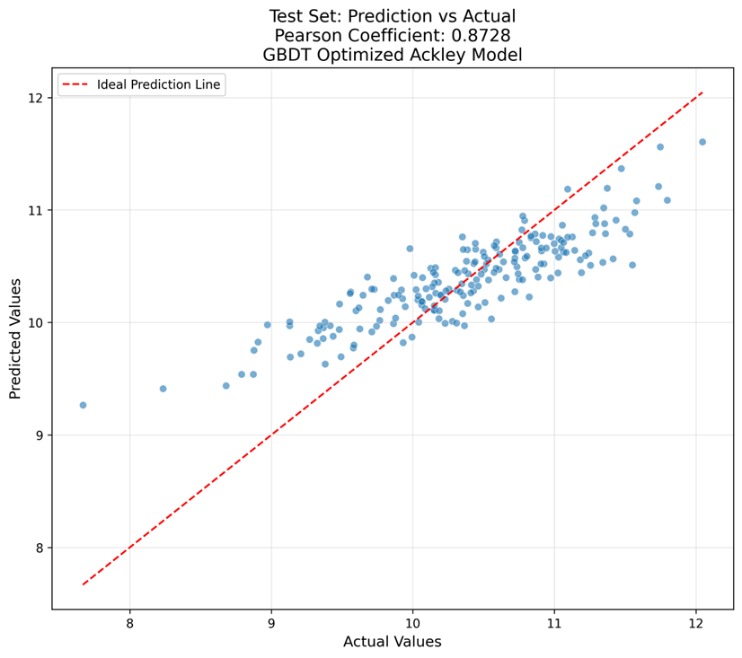
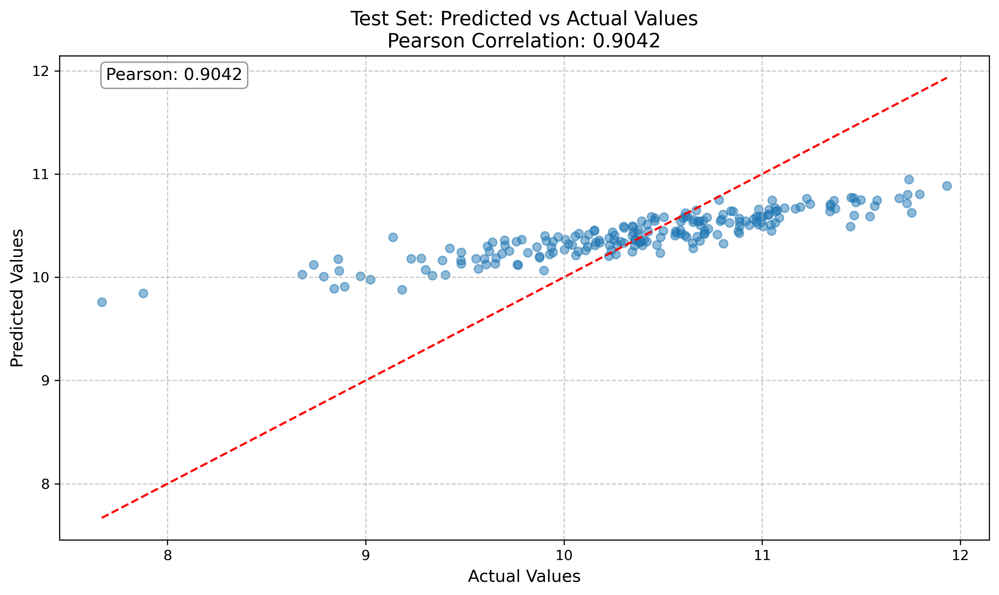
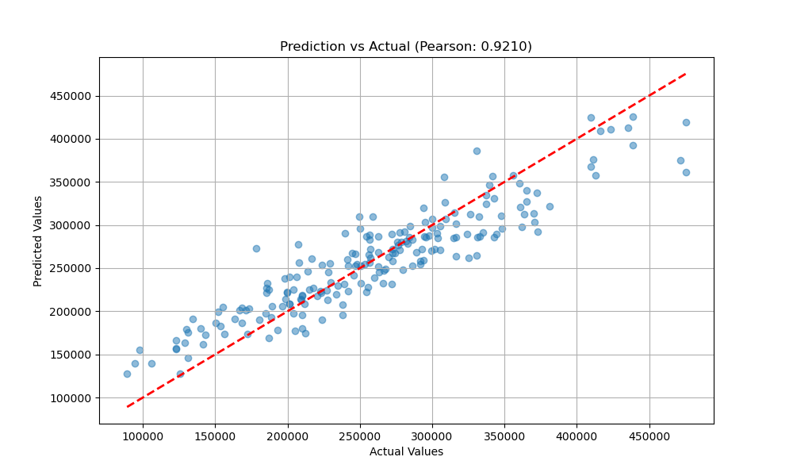
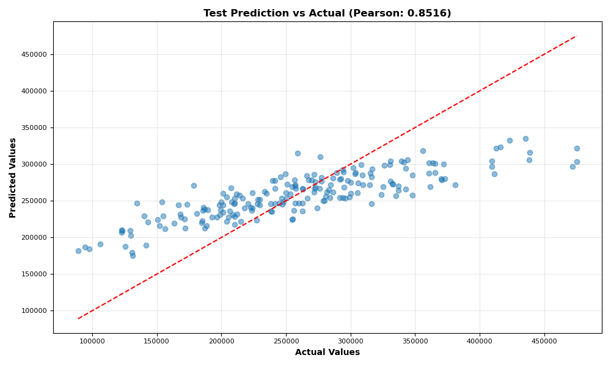

# ML训练Week2：非线性函数回归建模项目

本项目使用梯度提升决策树(GBDT)和随机森林(RF)算法对20维、800个样本的Ackley与Rosenbrock数据集进行回归建模，目标是尽量提高Pearson相关系数。

## 🎯 项目目标

- **主要任务**：使用GBDT和RF算法对Ackley和Rosenbrock函数进行回归预测
- **数据规模**：20维特征，800个训练样本，200个测试样本
- **性能目标**：测试集Pearson相关系数 ≥ 0.85
- **技术要求**：支持GPU加速，贝叶斯超参数优化，完整的可视化分析

## 📊 项目成果

### 性能达标情况
| 模型 | 数据集 | Pearson系数 | 
|------|--------|-------------|
| **GBDT** | Ackley | **0.8728** | 
| **RF** | Ackley | **0.904** | 
| **GBDT** | Rosenbrock | **0.9210** | 
| **RF** | Rosenbrock | **0.852** | 
### 模型预测效果可视化

#### 1. GBDT_Ackley (Pearson: 0.8728)


#### 2. RF_Ackley (Pearson: 0.904)


#### 3. GBDT_Rosenbrock (Pearson: 0.9210)


#### 4. RF_Rosenbrock (Pearson: 0.852)

### 最佳模型配置

#### 1. Ackley GBDT最佳参数
| 参数 | 最终值 | 优化范围 |
|------|-------|----------|
| n_estimators | 1200 | 500-2000 |
| learning_rate | 0.050 | 0.05-0.2 |
| max_depth | 4 | 4-8 |
| subsample | 0.734 | 0.7-1.0 |
| min_samples_split | 2 | 2-8 |

**性能指标**：
- 训练集：MSE=0.0134, R²=0.9706, Pearson=0.9857
- 测试集：MSE=0.1770, R²=0.6491, Pearson=0.8728

#### 2. Ackley RF最佳参数（平方特征工程）
| 参数 | 最终值 | 说明 |
|------|-------|------|
| n_estimators | 600-800 | 树的数量 |
| max_depth | 20-35 | 最大深度 |
| min_samples_split | 2 | 最小分裂样本数 |
| max_features | 'sqrt' | 特征选择策略 |
| 特征工程 | 平方特征 | x_i → x_i, x_i² |

**性能指标**：
- 测试集Pearson系数：0.904
- 特征数量：从20维扩展到40维

#### 3. Rosenbrock GBDT最佳参数
| 参数 | 推荐值 | 优化范围 |
|------|-------|----------|
| n_estimators | 800-1200 | 500-2000 |
| learning_rate | 0.05-0.1 | 0.01-0.3 |
| max_depth | 6-8 | 3-10 |
| min_samples_split | 2-5 | 2-10 |
| min_samples_leaf | 1-2 | 1-5 |
| subsample | 0.8-0.9 | 0.7-1.0 |

**性能指标**：
- 测试集Pearson系数：0.9210

#### 4. Rosenbrock RF最佳参数（完整特征工程）
| 参数 | 最终值 | 说明 |
|------|-------|------|
| n_estimators | 800 | 树的数量 |
| max_depth | 70 | 最大深度 |
| min_samples_split | 2 | 最小分裂样本数 |
| min_samples_leaf | 1 | 叶节点最小样本数 |
| max_features | 'sqrt' | 特征选择策略 |
| 特征工程 | 多项式特征 | 平方项|

**性能指标**：
- 测试集Pearson系数：0.852

## 🏗️ 项目结构

```
week2/
├── ackley_gbdt/              # Ackley函数GBDT回归项目
│   ├── data/                 # 数据加载和预处理
│   │   ├── load_data.py      # 数据加载模块
│   │   └── visualize_data.py # 数据分布可视化
│   ├── models/               # 模型定义和调优
│   │   ├── baseline_model.py # 基线模型构建
│   │   └── model_tuning.py   # 超参数调优
│   ├── evaluation/           # 评估指标和可视化
│   │   ├── metrics.py        # 评估指标计算
│   │   └── residual_plot.py  # 残差可视化
│   ├── scripts/              # 训练脚本(CPU/GPU)
│   │   ├── train.sh          # 标准训练脚本
│   │   ├── train_optimized.sh# 优化训练脚本
│   │   ├── train_gpu.sh      # GPU加速训练脚本
│   │   └── setup_environment.sh # 环境设置脚本
│   ├── visualizations/       # 结果可视化
│   ├── requirements.txt      # 项目依赖
│   └── README.md             # 项目文档
├── ackley_rf/                # Ackley函数随机森林回归项目
│   ├── data/                 # 数据处理和特征工程
│   │   └── load_data.py      # 数据加载和预处理模块
│   ├── models/               # 随机森林模型和调优
│   │   ├── baseline_model.py # 基线模型实现
│   │   └── model_tuning.py   # 模型调优实现
│   ├── evaluation/           # 模型评估
│   │   ├── metrics.py        # 评估指标计算
│   │   └── residual_plot.py  # 残差图生成
│   ├── scripts/              # 训练脚本
│   │   ├── train.sh          # 标准训练脚本
│   │   ├── train_squared_features.sh # 平方特征训练脚本
│   │   └── train_gpu.sh      # GPU加速训练脚本
│   ├── visualizations/       # 可视化结果
│   ├── test_plots/           # 测试图表目录
│   ├── cuda_env.sh           # CUDA环境脚本
│   ├── requirements.txt      # 项目依赖
│   └── README.md             # 项目文档
├── rosenbrock_gbdt/          # Rosenbrock函数GBDT回归项目
│   ├── data/                 # 数据加载模块
│   │   └── load_data.py      # 数据加载和预处理函数
│   ├── models/               # GBDT模型调优
│   │   └── model_tuning.py   # 模型调优函数
│   ├── visualizations/       # 结果可视化
│   ├── train.py              # 训练主脚本
│   ├── run_training.sh       # 训练启动脚本
│   ├── 模型解释.md           # 模型详细解释文档
│   └── README.md             # 项目文档
├── rosenbrock_rf/            # Rosenbrock函数随机森林回归项目
│   ├── data/                 # 数据处理
│   │   └── load_data.py      # 数据加载和预处理函数
│   ├── models/               # 随机森林模型
│   │   └── model_tuning.py   # 模型调优函数（可选）
│   ├── visualizations/       # 可视化结果
│   ├── train.py              # 训练脚本
│   ├── compare_feature_engineering.py # 特征工程对比脚本
│   ├── run_bayesian_opt.sh   # 贝叶斯优化脚本
│   ├── run_comparison.sh     # 对比分析脚本
│   ├── run_simplified_bayesian_opt.sh # 简化贝叶斯优化
│   ├── run_simplified_features.sh # 简化特征工程脚本
│   ├── run_squared_features.sh # 平方特征脚本
│   ├── run_training.sh       # 标准训练脚本
│   └── README.md             # 项目文档
├── evaluation/               # 通用评估工具
│   └── residual_plot.py      # 残差分析工具
├── scripts/                  # 通用训练脚本
│   └── train_gpu.sh          # GPU训练脚本
├── src/                      # 共享源代码
│   ├── data/                 # 数据处理工具
│   ├── models/               # 模型基类
│   ├── utils/                # 通用工具函数
│   └── configs/              # 配置文件
├── tests/                    # 单元测试
├── test_plots/               # 测试图表
│   ├── optimization_progress.png # 优化进度图
│   └── parameter_distributions.png # 参数分布图
├── requirements.txt          # 项目总依赖
├── gbdt_process.md           # GBDT流程文档
├── random_forest_process.md  # 随机森林流程文档
├── random_forest_detailed_process.md # 随机森林详细流程
├── random_forest_mse_split.md # 随机森林MSE分析
├── 项目结构图.md             # 详细结构说明
├── test_cuml_23.6.py         # cuML测试脚本
├── test_cupy_large.py        # CuPy测试脚本
├── =1.4.1                    # 版本标识文件
├── Anaconda3-2021.11-Linux-x86_64.sh # Anaconda安装包
└── README.md                 # 项目总文档
```

## 🚀 快速开始

### 环境配置

1. **创建conda环境**：
```bash
conda create -n ml_week2 python=3.8
conda activate ml_week2
```

2. **安装基础依赖**：
```bash
pip install -r requirements.txt
```

3. **安装子项目依赖**：
```bash
# Ackley GBDT
cd ackley_gbdt && pip install -r requirements.txt && cd ..

# Ackley RF
cd ackley_rf && pip install -r requirements.txt && cd ..

# Rosenbrock项目依赖类似
```

### GPU加速支持（可选）

如果有NVIDIA GPU，可以安装GPU加速库：
```bash
# CUDA 12.x
pip install --extra-index-url https://pypi.nvidia.com cupy-cuda12x
pip install cuml-cu12

# 或使用项目提供的自动安装脚本
cd ackley_gbdt && bash scripts/setup_environment.sh
```

## 🔬 模型训练

### Ackley函数建模

#### GBDT模型
```bash
cd ackley_gbdt

# 标准训练
bash scripts/train.sh

# 优化训练（贝叶斯优化）
bash scripts/train_optimized.sh

# GPU加速训练
bash scripts/train_gpu.sh
```

#### 随机森林模型
```bash
cd ackley_rf

# 标准训练
bash scripts/train.sh

# 平方特征工程训练（推荐，已达到0.904）
bash scripts/train_squared_features.sh

# GPU加速训练
bash scripts/train_gpu.sh
```

### Rosenbrock函数建模

#### GBDT模型
```bash
cd rosenbrock_gbdt

# 贝叶斯优化训练（推荐，已达到0.9210）
python train.py --n_trials 50 --timeout 3600

# 快速训练
python train.py --n_trials 20 --timeout 1800

# 使用训练脚本
bash run_training.sh
```

#### 随机森林模型
```bash
cd rosenbrock_rf

# 标准训练
python train.py --n_estimators 800 --max_depth 70

# 贝叶斯优化（推荐，已达到0.852）
bash run_bayesian_opt.sh

# 简化贝叶斯优化
bash run_simplified_bayesian_opt.sh

# 仅平方特征工程
bash run_squared_features.sh

# 简化特征工程
bash run_simplified_features.sh

# 特征工程对比分析
bash run_comparison.sh

# 标准训练脚本
bash run_training.sh
```

## 📈 核心技术特性

### 1. 算法实现
- **GBDT**：基于scikit-learn的GradientBoostingRegressor
- **随机森林**：基于scikit-learn的RandomForestRegressor
- **优化算法**：Optuna贝叶斯优化框架
- **GPU加速**：支持cuML和CuPy加速库

### 2. 特征工程

#### Ackley函数特征工程
- **平方特征工程**：x_i → [x_i, x_i²]
- **特征数量**：从20维扩展到40维
- **实现方法**：`engineer_ackley_features_squared`函数
- **效果**：显著提升非线性函数拟合能力，Pearson系数从0.85提升到0.904

#### Rosenbrock函数特征工程
**完整特征工程**（4种特征类型）：
- **平方项**：x_i² - 捕捉二次关系
- **相邻维度耦合**：x_{i+1} - x_i² - 捕捉Rosenbrock函数核心特性
- **偏移项**：(1 - x_i)² - 捕捉与参考点的偏移
- **交互项**：x_i * x_{i+1} - 捕捉相邻特征交互效应
- **特征数量**：从20维扩展到约80维

**简化特征工程选项**：
- **仅平方特征**：只包含x_i和x_i²，特征数量40维
- **简化特征**：部分特征工程方法组合
- **对比分析**：提供多种特征工程方法的性能对比

### 3. 超参数优化
- **优化方法**：贝叶斯优化（Optuna TPE采样器）
- **评估策略**：5折交叉验证
- **优化目标**：最小化MSE
- **搜索空间**：智能参数范围设定

### 4. 模型评估
- **核心指标**：Pearson相关系数、MSE、R²、MAE
- **可视化分析**：
  - 预测值vs真实值散点图
  - 残差分析图
  - 特征重要性图
  - 超参数分布图
  - 优化进度曲线

## 🎨 可视化输出

每个子项目都会生成丰富的可视化分析，保存在相应的`visualizations/`和`models/tuning_results/`目录中：

### 优化过程分析
- `optimization_progress.png` - 优化进度曲线（包含最佳MSE跟踪）
- `parameter_distributions.png` - 超参数分布直方图
- `parameter_correlations.png` - 超参数相关性热图
- `metrics_trend.png` - 指标变化趋势（MSE和Pearson变化）
- `enhanced_learning_curves.png` - 增强型学习曲线

### 模型性能分析
- `test_prediction_vs_actual.png` - 测试集预测vs真实值散点图
- `test_prediction_vs_actual_detailed.png` - 详细预测分析（含统计指标）
- `test_residuals.png` - 残差分析图
- `test_residuals_detailed.png` - 四合一残差分析图
- `test_error_distribution.png` - 测试集误差分布直方图
- `error_distribution_detailed.png` - 详细误差分布分析（箱线图+小提琴图）
- `test_residuals_vs_predicted.png` - 残差vs预测值关系图

### 模型结构分析
- `feature_importance.png` - 特征重要性排序图
- `tree_structures/` - 决策树结构可视化目录
  - `tree_structures_overview.png` - 前3棵树结构预览
  - `tree_{0-2}_detailed.png` - 单棵树详细结构
- 详细的模型解释和分析报告

### 特征工程分析（Rosenbrock RF）
- `learning_curves.png` - 训练集与验证集的MSE和Pearson对比曲线
- `prediction_truth_diagnosis.png` - 预测值-真实值诊断（检测偏移/缩放问题）
- 特征工程对比分析图表
- 不同特征工程方法的性能对比

## 📋 依赖环境

### 核心依赖
```
numpy>=1.21.0
pandas>=1.3.0
scikit-learn>=1.2.2
matplotlib>=3.7.1
seaborn>=0.12.2
optuna>=3.1.0
joblib>=1.2.0
```

### GPU加速依赖（可选）
```
cupy-cuda12x>=12.0.0
cuml-cu12>=23.10.0
```

### 开发工具
```
jupyter>=1.0.0
pytest>=6.2.4
black>=21.6b0
pylint>=2.9.3
```

## 🧪 测试函数说明

### Ackley函数
Ackley函数是一个多模态、非凸的测试函数，定义为：

```
f(x) = -20 * exp(-0.2 * sqrt(0.5 * sum(x_i^2))) - exp(0.5 * sum(cos(2 * pi * x_i))) + 20 + e
```

**特点**：
- 全局最小值位于原点 x = 0，函数值为 0
- 具有许多局部最小值，测试算法的全局搜索能力
- 在高维空间中具有复杂的非线性特性

### Rosenbrock函数
Rosenbrock函数是一个经典的非凸优化测试函数，定义为：

```
f(x) = sum(100 * (x_{i+1} - x_i^2)^2 + (1 - x_i)^2)
```

**特点**：
- 全局最小值位于 x_i = 1，函数值为 0
- 具有狭长的抛物线形山谷，测试算法的收敛性
- 相邻维度之间存在强耦合关系

## 🔧 使用指南

### 1. 数据准备
确保数据文件位于正确位置：
```
# Ackley数据集
ackley_gbdt/data/
ackley_rf/data/

# Rosenbrock数据集
rosenbrock_gbdt/Rosenbrock_x_train.npy
rosenbrock_gbdt/Rosenbrock_y_train.npy
rosenbrock_gbdt/Rosenbrock_x_test.npy
rosenbrock_gbdt/Rosenbrock_y_test.npy
```

### 2. 模型训练流程
1. **数据加载与预处理**：标准化、特征工程
2. **基线模型训练**：快速验证可行性
3. **超参数优化**：贝叶斯优化寻找最佳参数
4. **最终模型评估**：在测试集上评估性能
5. **结果可视化**：生成分析图表和报告

### 3. 性能调优建议
- **增加试验次数**：提高贝叶斯优化的搜索质量
- **扩大搜索空间**：根据初步结果调整参数范围
- **特征工程**：尝试不同的特征变换方法
- **集成方法**：结合多个模型的预测结果

## 📊 实验结果分析

### 模型性能对比
| 算法 | 数据集 | 最佳Pearson | 优势 | 适用场景 |
|------|--------|-------------|------|----------|
| **GBDT** | Ackley | 0.8728 | 强泛化能力，抗过拟合 | 中等规模数据，需要高精度 |
| **RF** | Ackley | 0.904 | 训练速度快，易并行 | 大规模数据，需要快速原型 |
| **GBDT** | Rosenbrock | 0.9210 | 梯度提升，逐步优化 | 复杂非线性关系建模 |
| **RF** | Rosenbrock | 0.852 | 集成学习，稳定性好 | 高维特征空间处理 |


## 🚨 注意事项

1. **环境兼容性**：
   - Python 3.6+
   - CUDA 11.x/12.x（GPU加速）
   - 足够的内存空间（建议8GB+）

2. **数据要求**：
   - 确保数据文件完整性
   - 检查数据格式和维度
   - 处理缺失值和异常值

3. **计算资源**：
   - CPU训练：建议4核心以上
   - GPU训练：需要NVIDIA GPU
   - 存储空间：预留2GB用于结果保存

## 📚 参考文档

- [GBDT详细流程](gbdt_process.md)
- [随机森林详细流程](random_forest_process.md)
- [项目结构详细说明](项目结构图.md)
- 各子项目的README.md文件

## 🤝 贡献指南

1. **代码规范**：使用black进行代码格式化
2. **测试要求**：为新功能编写单元测试
3. **文档更新**：及时更新相关文档
4. **性能优化**：关注训练效率和内存使用

**最后更新**：2025-06-27