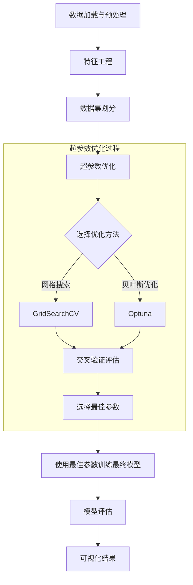
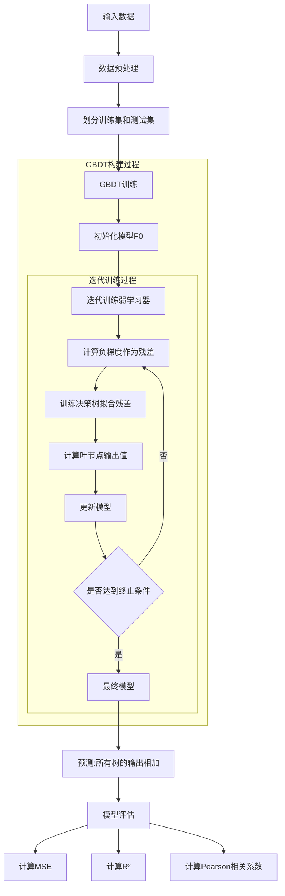
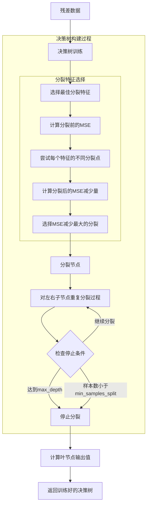
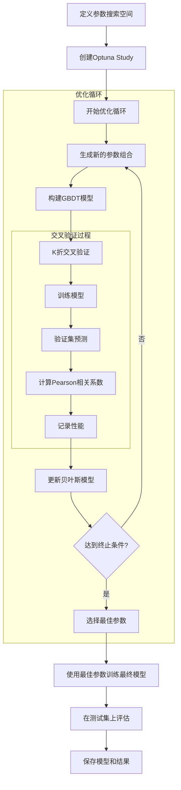
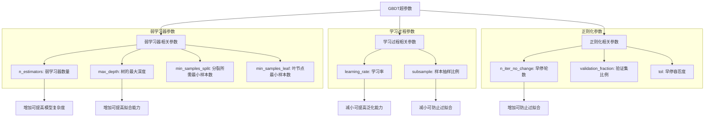
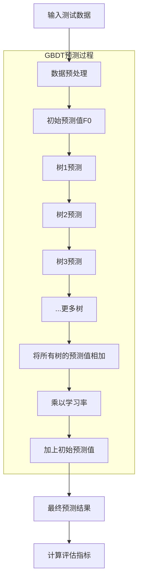
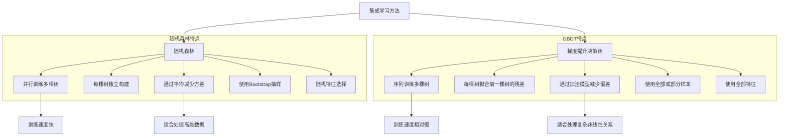
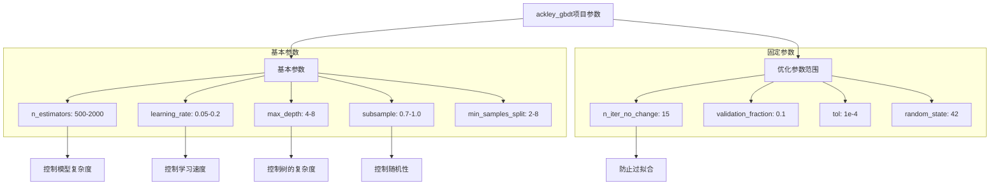

# 梯度提升决策树(GBDT)生成过程流程图

下面的流程图详细展示了ackley_gbdt项目中梯度提升决策树(GBDT)模型的生成过程，从数据准备到模型评估的完整流程。

## GBDT训练流程

## GBDT模型构建详细流程

## 单棵决策树训练流程

## 贝叶斯优化流程

## GBDT中的超参数影响

## GBDT预测过程

## GBDT与随机森林的区别

## GBDT在ackley_gbdt项目中的参数设置

