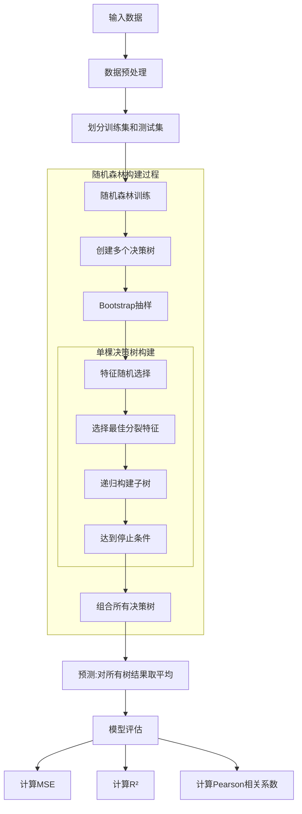
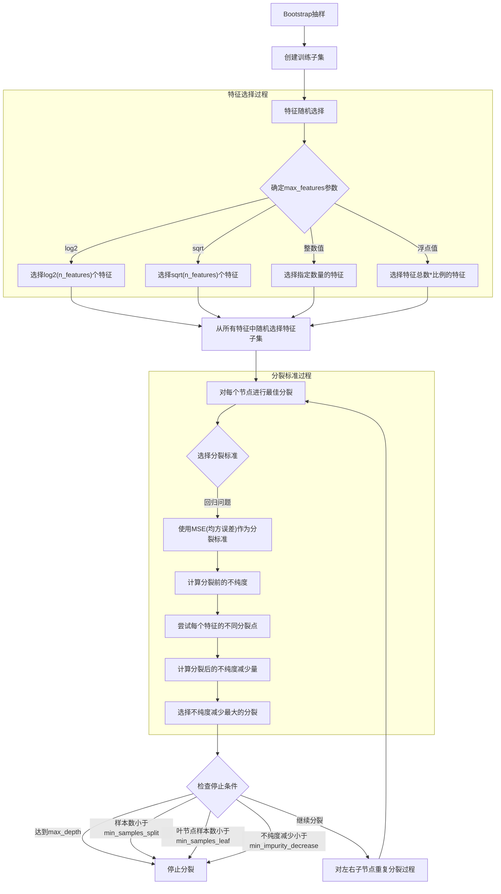
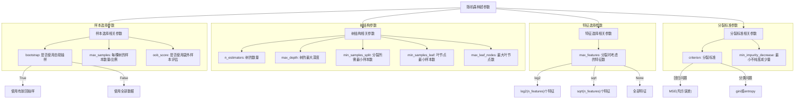
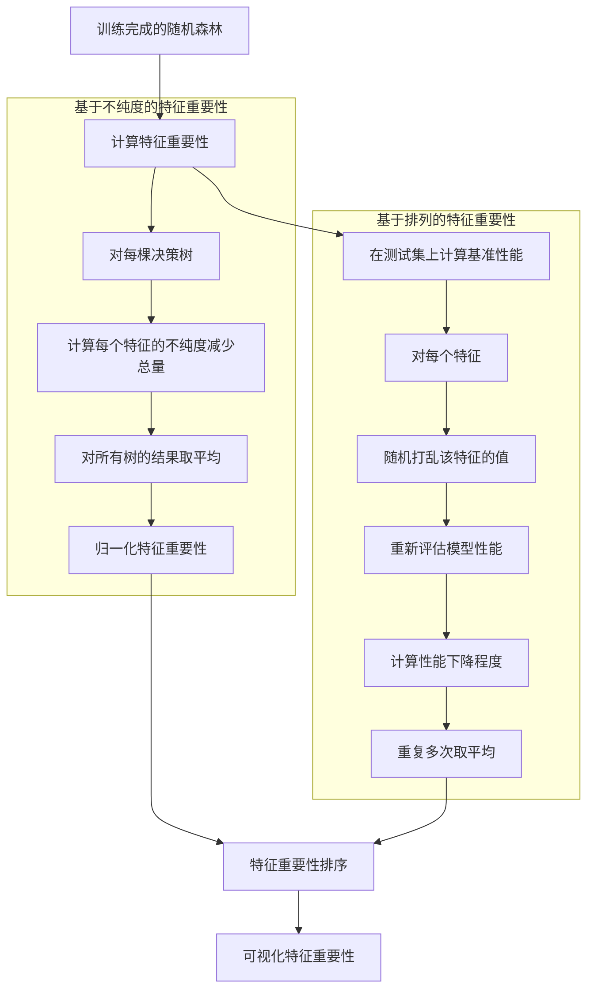
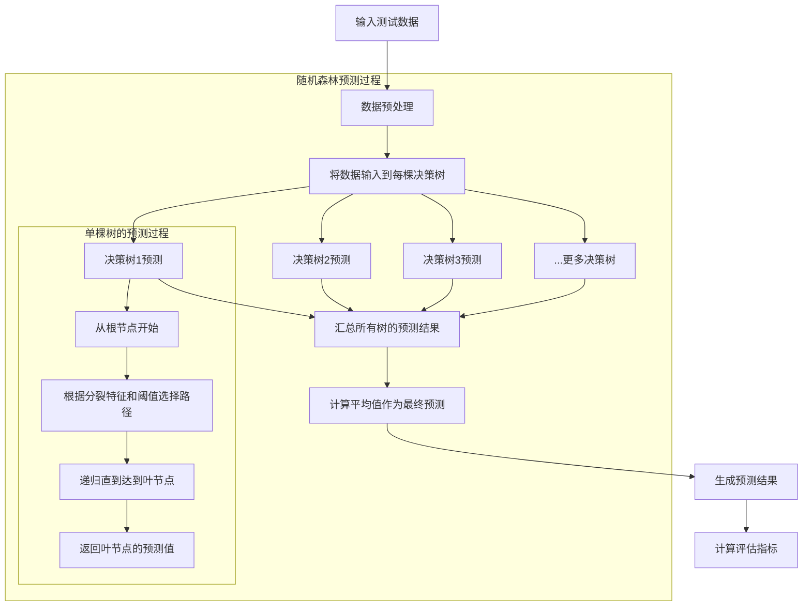
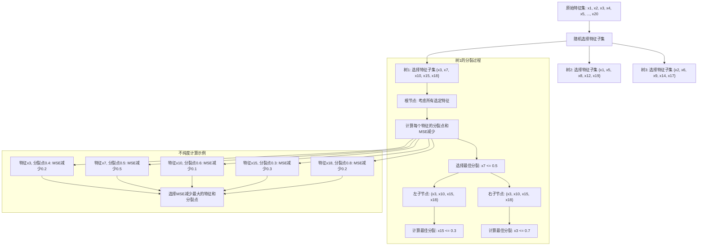

# 随机森林模型构建详细流程

下面的流程图详细展示了随机森林模型的构建过程，特别关注特征选择和分裂标准的机制。

## 随机森林构建核心流程

```mermaid
flowchart TD
    A[输入数据] --> B[数据预处理]
    B --> C[划分训练集和测试集]
    
    C --> D[随机森林训练]
    
    subgraph 随机森林构建过程
        D --> E[创建多个决策树]
        
        E --> F[Bootstrap抽样]
        F --> G[特征随机选择]
        
        subgraph 单棵决策树构建
            G --> H[选择最佳分裂特征]
            H --> I[递归构建子树]
            I --> J[达到停止条件]
        end
        
        J --> K[组合所有决策树]
    end
    
    K --> L[预测:对所有树结果取平均]
    L --> M[模型评估]
    
    M --> N[计算MSE]
    M --> O[计算R²]
    M --> P[计算Pearson相关系数]
```

## 特征选择与分裂标准详细流程

```mermaid
flowchart TD
    A[Bootstrap抽样] --> B[创建训练子集]
    B --> C[特征随机选择]
    
    subgraph 特征选择过程
        C --> D{确定max_features参数}
        D -->|log2| E["选择log2(n_features)个特征"]
        D -->|sqrt| F["选择sqrt(n_features)个特征"]
        D -->|整数值| G["选择指定数量的特征"]
        D -->|浮点值| H["选择特征总数*比例的特征"]
    end
    
    E --> I[从所有特征中随机选择特征子集]
    F --> I
    G --> I
    H --> I
    
    I --> J[对每个节点进行最佳分裂]
    
    subgraph 分裂标准过程
        J --> K{选择分裂标准}
        K -->|回归问题| L["使用MSE(均方误差)作为分裂标准"]
        
        L --> M["计算分裂前的不纯度"]
        M --> N["尝试每个特征的不同分裂点"]
        N --> O["计算分裂后的不纯度减少量"]
        O --> P["选择不纯度减少最大的分裂"]
    end
    
    P --> Q{检查停止条件}
    Q -->|达到max_depth| R[停止分裂]
    Q -->|样本数小于min_samples_split| R
    Q -->|叶节点样本数小于min_samples_leaf| R
    Q -->|不纯度减少小于min_impurity_decrease| R
    
    Q -->|继续分裂| S[对左右子节点重复分裂过程]
    S --> J
```

## 随机森林中的超参数影响

```mermaid
flowchart TD
    A[随机森林超参数] --> B[样本选择相关参数]
    A --> C[树结构相关参数]
    A --> D[特征选择相关参数]
    A --> E[分裂标准相关参数]
    
    subgraph 样本选择参数
        B --> B1[bootstrap: 是否使用自助抽样]
        B --> B2[max_samples: 每棵树的样本数量/比例]
        B --> B3[oob_score: 是否使用袋外样本评估]
    end
    
    subgraph 树结构参数
        C --> C1[n_estimators: 树的数量]
        C --> C2[max_depth: 树的最大深度]
        C --> C3[min_samples_split: 分裂所需最小样本数]
        C --> C4[min_samples_leaf: 叶节点最小样本数]
        C --> C5[max_leaf_nodes: 最大叶节点数]
    end
    
    subgraph 特征选择参数
        D --> D1[max_features: 分裂时考虑的特征数]
    end
    
    subgraph 分裂标准参数
        E --> E1[criterion: 分裂标准]
        E --> E2[min_impurity_decrease: 最小不纯度减少量]
    end
    
    B1 -->|True| F[使用有放回抽样]
    B1 -->|False| G[使用全部数据]
    
    D1 -->|log2| H["log2(n_features)个特征"]
    D1 -->|sqrt| I["sqrt(n_features)个特征"]
    D1 -->|None| J["全部特征"]
    
    E1 -->|回归问题| K["MSE(均方误差)"]
    E1 -->|分类问题| L["gini或entropy"]
```

## 特征重要性计算流程

```mermaid
flowchart TD
    A[训练完成的随机森林] --> B[计算特征重要性]
    
    subgraph 基于不纯度的特征重要性
        B --> C[对每棵决策树]
        C --> D[计算每个特征的不纯度减少总量]
        D --> E[对所有树的结果取平均]
        E --> F[归一化特征重要性]
    end
    
    subgraph 基于排列的特征重要性
        B --> G[在测试集上计算基准性能]
        G --> H[对每个特征]
        H --> I[随机打乱该特征的值]
        I --> J[重新评估模型性能]
        J --> K[计算性能下降程度]
        K --> L[重复多次取平均]
    end
    
    F --> M[特征重要性排序]
    L --> M
    M --> N[可视化特征重要性]
```

## 随机森林预测过程

```mermaid
flowchart TD
    A[输入测试数据] --> B[数据预处理]
    
    subgraph 随机森林预测过程
        B --> C[将数据输入到每棵决策树]
        
        C --> D[决策树1预测]
        C --> E[决策树2预测]
        C --> F[决策树3预测]
        C --> G[...更多决策树]
        
        subgraph 单棵树的预测过程
            D --> D1[从根节点开始]
            D1 --> D2[根据分裂特征和阈值选择路径]
            D2 --> D3[递归直到达到叶节点]
            D3 --> D4[返回叶节点的预测值]
        end
        
        D --> H[汇总所有树的预测结果]
        E --> H
        F --> H
        G --> H
        
        H --> I[计算平均值作为最终预测]
    end
    
    I --> J[生成预测结果]
    J --> K[计算评估指标]
```

## 随机森林中的特征选择与分裂过程示例

```mermaid
flowchart TD
    A[原始特征集: x1, x2, x3, x4, x5, ..., x20] --> B[随机选择特征子集]
    
    B --> C["树1: 选择特征子集 {x3, x7, x10, x15, x18}"]
    B --> D["树2: 选择特征子集 {x1, x5, x8, x12, x19}"]
    B --> E["树3: 选择特征子集 {x2, x6, x9, x14, x17}"]
    
    subgraph 树1的分裂过程
        C --> F[根节点: 考虑所有选定特征]
        F --> G["计算每个特征的分裂点和MSE减少"]
        G --> H["选择最佳分裂: x7 <= 0.5"]
        
        H --> I["左子节点: {x3, x10, x15, x18}"]
        H --> J["右子节点: {x3, x10, x15, x18}"]
        
        I --> K["计算最佳分裂: x15 <= 0.3"]
        J --> L["计算最佳分裂: x3 <= 0.7"]
    end
    
    subgraph 不纯度计算示例
        G --> M["特征x3, 分裂点0.4: MSE减少0.2"]
        G --> N["特征x7, 分裂点0.5: MSE减少0.5"]
        G --> O["特征x10, 分裂点0.6: MSE减少0.1"]
        G --> P["特征x15, 分裂点0.3: MSE减少0.3"]
        G --> Q["特征x18, 分裂点0.8: MSE减少0.2"]
        
        M --> R["选择MSE减少最大的特征和分裂点"]
        N --> R
        O --> R
        P --> R
        Q --> R
    end
``` 