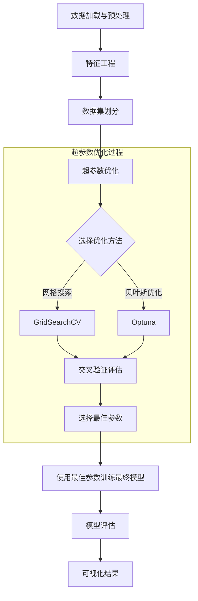
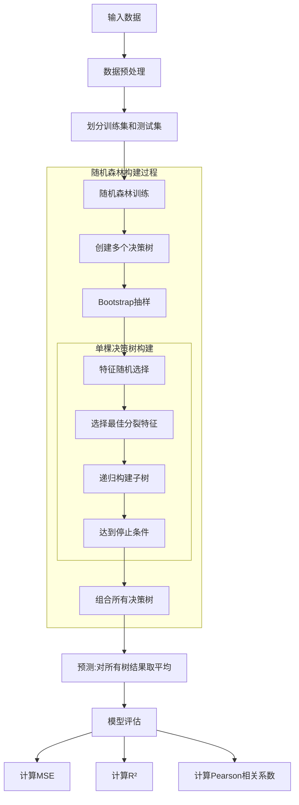
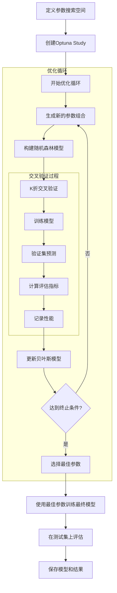
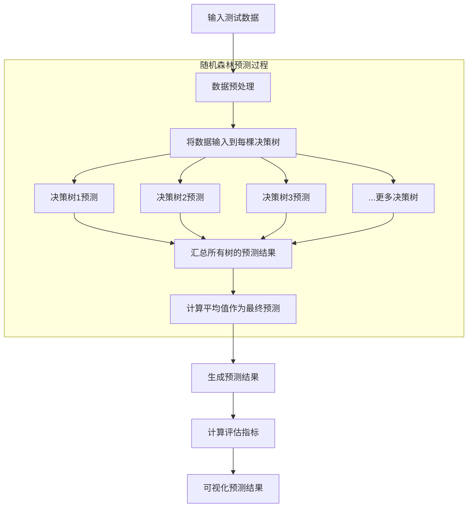
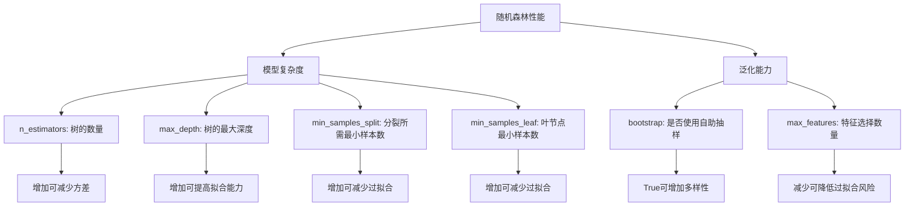

# 随机森林生成过程流程图

下面的流程图展示了ackley_rf项目中随机森林模型的生成过程，从数据准备到模型评估的完整流程。

## 随机森林训练流程

```mermaid
flowchart TD
    A[数据加载与预处理] --> B[特征工程]
    B --> C[数据集划分]
    C --> D[超参数优化]
    
    subgraph 超参数优化过程
        D --> E{选择优化方法}
        E -->|网格搜索| F[GridSearchCV]
        E -->|贝叶斯优化| G[Optuna]
        
        F --> H[交叉验证评估]
        G --> H
        
        H --> I[选择最佳参数]
    end
    
    I --> J[使用最佳参数训练最终模型]
    J --> K[模型评估]
    K --> L[可视化结果]
```

## 随机森林模型构建详细流程

```mermaid
flowchart TD
    A[输入数据] --> B[数据预处理]
    B --> C[划分训练集和测试集]
    
    C --> D[随机森林训练]
    
    subgraph 随机森林构建过程
        D --> E[创建多个决策树]
        
        E --> F[Bootstrap抽样]
        F --> G[特征随机选择]
        
        subgraph 单棵决策树构建
            G --> H[选择最佳分裂特征]
            H --> I[递归构建子树]
            I --> J[达到停止条件]
        end
        
        J --> K[组合所有决策树]
    end
    
    K --> L[预测:对所有树结果取平均]
    L --> M[模型评估]
    
    M --> N[计算MSE]
    M --> O[计算R²]
    M --> P[计算Pearson相关系数]
```

## 贝叶斯优化流程

```mermaid
flowchart TD
    A[定义参数搜索空间] --> B[创建Optuna Study]
    B --> C[开始优化循环]
    
    subgraph 优化循环
        C --> D[生成新的参数组合]
        D --> E[构建随机森林模型]
        E --> F[K折交叉验证]
        
        subgraph 交叉验证过程
            F --> G[训练模型]
            G --> H[验证集预测]
            H --> I[计算评估指标]
            I --> J[记录性能]
        end
        
        J --> K[更新贝叶斯模型]
        K --> L{达到终止条件?}
        L -->|否| D
        L -->|是| M[选择最佳参数]
    end
    
    M --> N[使用最佳参数训练最终模型]
    N --> O[在测试集上评估]
    O --> P[保存模型和结果]
```

## 随机森林预测过程

```mermaid
flowchart TD
    A[输入测试数据] --> B[数据预处理]
    
    subgraph 随机森林预测过程
        B --> C[将数据输入到每棵决策树]
        
        C --> D[决策树1预测]
        C --> E[决策树2预测]
        C --> F[决策树3预测]
        C --> G[...更多决策树]
        
        D --> H[汇总所有树的预测结果]
        E --> H
        F --> H
        G --> H
        
        H --> I[计算平均值作为最终预测]
    end
    
    I --> J[生成预测结果]
    J --> K[计算评估指标]
    K --> L[可视化预测结果]
```

## 随机森林参数调优关系图

```mermaid
flowchart TD
    A[随机森林性能] --> B[模型复杂度]
    A --> C[泛化能力]
    
    B --> D[n_estimators: 树的数量]
    B --> E[max_depth: 树的最大深度]
    B --> F[min_samples_split: 分裂所需最小样本数]
    B --> G[min_samples_leaf: 叶节点最小样本数]
    
    C --> H[bootstrap: 是否使用自助抽样]
    C --> I[max_features: 特征选择数量]
    
    D --> J[增加可减少方差]
    E --> K[增加可提高拟合能力]
    F --> L[增加可减少过拟合]
    G --> M[增加可减少过拟合]
    H --> N[True可增加多样性]
    I --> O[减少可降低过拟合风险]
``` 